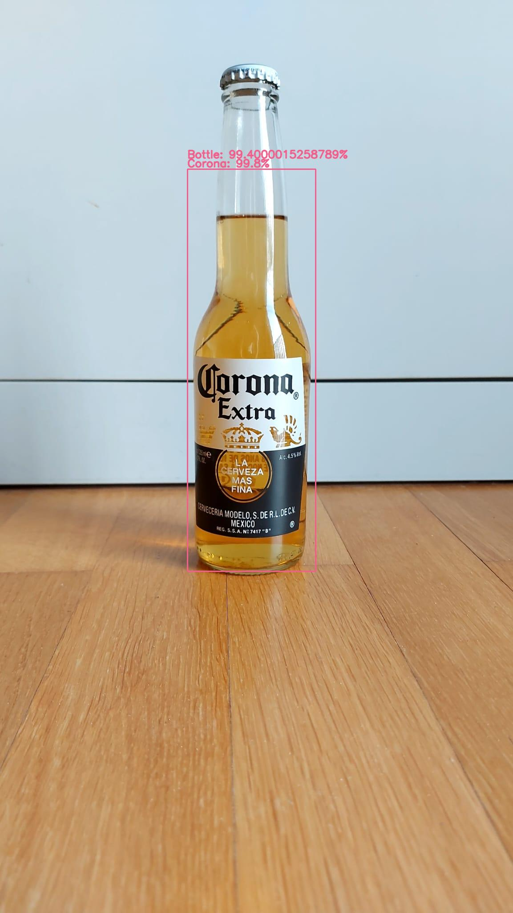
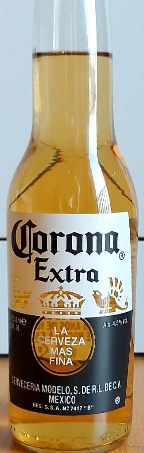

# AI beer detection and beer brand classification using pytorch



## Poject Structure

The repo consists of the following files and folders:
- inputs/ (input folder for (test) images)
- models/ (includes the fine-tuned classification model)
- outputs/ (this is where the detection/classification results are placed)
- beer_names.py (list of trained beer brands)
- classify.py (beer brand classification)
- coco_names.py (coco classes for bottle detection)
- dataset_helpers.py (useful functions to organize datasets)
- detect_utils.py (helper functions for bottle detection and beer brand classification)
- detect.py (main file, used for detection and classification in one step)


## How does it work?

All code is written in python using pytorch. In the following sections, I want to highlight the most important aspects of this project:

### Beer detection

For the detection, I used a pretrained faster-rcnn resnet50 model which was trained on the coco dataset. That way it's able to detect bottles. I made minor adjustments to ignore all other objects and save a copy of the image cropped down to the bottle's bounding box.
The cropped image of a bottle can be found in outputs/. It can handle multiple bottles in one picture. The main command is:
```
python detect.py --input <path_to_image>
```




When running this command it also imports the classification functions and does the beer brand classification.


### Beer brand classification

The beer classification model is based on a fine-tuned resnet50 architecture. For more information scroll down to the training section.

The command to do classification only is:
```
python classify.py --input <path_to_image>
```


This prints the percentages to the console.
Make sure to only used this on cropped images (so you have to run detection beforehand).

The recommended way is to run (which does detection and classification in one step, take a look at the detection section):
```
python detect.py --input <path_to_image>
```


### How to train your own model?

If you want to train your own beer classification model you can use the functions in train.py

The classification model was trained on (a couple of hundred) images of beer bottles that I've downloaded from Google Images (You can use the chrome extension "Download all Images").

After downloading images, the folder structure should be as followed:
```
.
+--data
|  +--original
|       +--corona
|          +--filename_corona_image1.jpg (etc)
|       +--paulaner (or any other beer brand)
|          +--filename_paulaner_image1.jpg (etc)
```

Next step is to split the images into training and validtion. You can use the function "split_trainval" specified in dataset_helpers.py
After that, the folder structure should be:
```
.
+--data
|  +--original
|     +--train
|        +--corona
|        +--paulaner (or any other beer brand)
|        (etc)
|     +--val
|        +--corona
|        +--paulaner (or any other beer brand)
|        (etc)
```
Now that they are in the right folders, the second step is crop the images. This can be done using the function "crop_images_to_directory" in dataset_helpers.py which uses the detection part. The cropped images should be saved to data/detected/.
The folder structure should now be:
```
.
+--data
|  +--original
|  +--dectected
|     +--train
|     +--val
```
The final step is to actually train the model based on the cropped beer images. The functions can be found in train.py. I choose the parameters to get it running as soon as possible but I'm sure the accuracy can be improved by adjusting the parameters.

## Comments or tips?

If you have comments, tips, questions etc. feel free to contact me!
